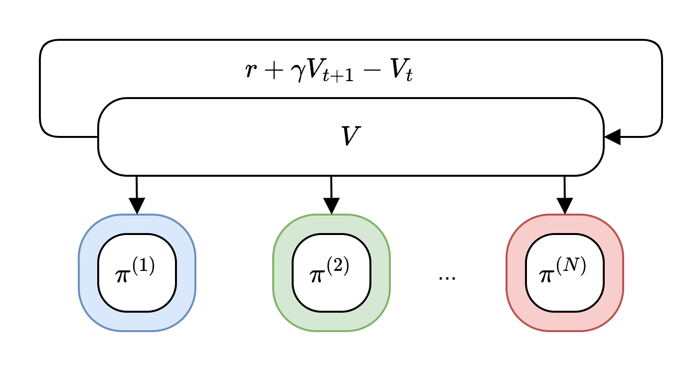
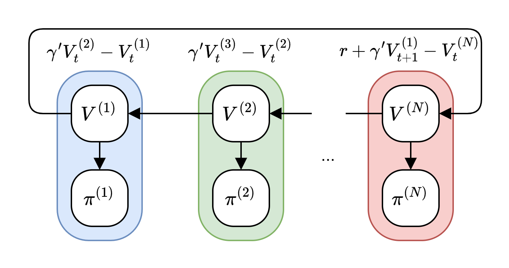

# Agent-Chained Policy Optimization (ACPO)

<h1 align="center"> Agent-Chained Policy Optimization (ACPO) </h1>

<div align="center">
  
  
  <p><em>Centralized Critics (left) commonly used in prior work and Decentralized Critics (right) with agent chaining used in ACPO.</em></p>
</div>

ACPO is a multi-agent reinforcement learning framework that extends MARLlib with agent-chained policy optimization algorithms. This repository supports training on RWARE, SMACv2, and MAMuJoCo environments using both Condor distributed computing and single GPU training.

## Installation

> **Note**: This framework is only compatible with Linux operating systems.

### Step 1: Clone Repository and Setup Environment

```bash
# Clone the repository
cd acpo

# Create conda environment
conda create -n acpo python=3.8
conda activate acpo

# Install PyTorch (CUDA 11.1)
pip install torch==1.9.0+cu111 -f https://download.pytorch.org/whl/torch_stable.html

# Install basic dependencies
pip install -r requirements.txt
```

### Step 2: Install Environment Dependencies

#### RWARE Environment
Follow the [MARLlib RWARE installation guide](https://marllib.readthedocs.io/en/latest/handbook/env.html#rware):

```bash
# RWARE installation
pip install rware==1.0.1
```

#### SMACv2 Environment
```bash
# Install StarCraft II
bash install_sc2.sh

# Install SMACv2
pip install git+https://github.com/oxwhirl/smacv2.git
```

#### MAMuJoCo Environment

MAMuJoCo can be installed two ways. **The Gymnasium-Robotics backend (recommended)** is far simpler as it uses the modern `mujoco` bindings and requires no `mujoco200` download, `mujoco-py`, or external `multiagent_mujoco` clone.

**Option A — Gymnasium-Robotics backend (recommended)**

Uses the `gymnasium_mamujoco` environment, backed by [Gymnasium-Robotics](https://robotics.farama.org/envs/MaMuJoCo/):

```bash
# Installs gymnasium (>=1.0) and the modern mujoco bindings as dependencies.
# gymnasium-robotics 1.3.1 supports Python 3.8.
pip install "gymnasium-robotics==1.3.1"
pip install "numpy==1.23.5"

```

`gym` (0.20.0, used by RLlib) and `gymnasium` coexist as separate packages, so this
does not affect the RWARE/SMACv2 setup. Train with `--env gymnasium_mamujoco` (see below).

**Option B — Legacy mujoco-py backend**

Follow the [MARLlib MAMuJoCo installation guide](https://marllib.readthedocs.io/en/latest/handbook/env.html#mamujoco):

```bash
# Create MuJoCo directory
mkdir /home/YourUserName/.mujoco
cd /home/YourUserName/.mujoco

# Download and install MuJoCo
wget https://roboti.us/download/mujoco200_linux.zip
unzip mujoco200_linux.zip
export LD_LIBRARY_PATH=/home/YourUserName/.mujoco/mujoco200/bin:$LD_LIBRARY_PATH

# Install MuJoCo Python bindings
pip install mujoco-py==2.0.2.8

# Clone and install multiagent_mujoco
git clone https://github.com/schroederdewitt/multiagent_mujoco
cd multiagent_mujoco
mv multiagent_mujoco /home/YourPathTo/acpo/multiagent_mujoco

# Optional: Install additional dependencies
sudo apt-get install libosmesa6-dev
pip install patchelf-wrapper
```

### Step 3: Install Gym and Apply Patches

```bash
# Install compatible Gym version
pip install "gym==0.20.0"

# Apply RLlib patches
cd marllib/patch
python add_patch.py -y
```

### Step 4: Optional - CentOS Specific Setup

For CentOS systems, install additional dependencies:

```bash
# Install libstdc++
conda install -c conda-forge "libstdcxx-ng>=9"

# Add to your condor script or environment
export LD_LIBRARY_PATH="$CONDA_PREFIX/lib:/usr/lib64:$SC2PATH/Libs:${LD_LIBRARY_PATH:-}"
```

## Training Methods

### Method 1: Condor Distributed Training (Recommended for Large-Scale Experiments)

Use Condor for distributed training across multiple machines:

#### RWARE Training
```bash
# Submit RWARE training jobs
# condor_rware.sh & main_condor_rware.py
condor_submit condor-scripts/condor_rware.submit
```

#### SMACv2 Training
```bash
# Submit SMACv2 training jobs
# condor_smac.sh & main_condor_smac.py
condor_submit condor-scripts/condor_smac.submit
```

#### MAMuJoCo Training
```bash
# Submit MAMuJoCo training jobs
# condor_mamujoco.sh & main_condor_mamujoco.py
condor_submit condor-scripts/condor_mamujoco.submit
```

### Method 2: Single GPU Training

For single machine training with GPU acceleration:

```bash
# Train on single GPU
python train_gpu.py --env rware --map small-8-hard --algo acppo --hyperparam_source rware --num_gpus 1

# Train SMACv2
python train_gpu.py --env smacv2 --map terran_5_vs_5 --algo acppo --hyperparam_source smacv2 --num_gpus 1

# Train MAMuJoCo (Gymnasium-Robotics backend, recommended)
python train_gpu.py --env gymnasium_mamujoco --map 2AgentHalfCheetah --algo acppo --hyperparam_source mamujoco_halfcheetah --num_gpus 1

# Train MAMuJoCo (legacy mujoco-py backend)
python train_gpu.py --env mamujoco --map 2AgentHalfCheetah --algo acppo --hyperparam_source mamujoco_halfcheetah --num_gpus 1
```

### Training Parameters

Key parameters for `train_gpu.py`:

| Parameter | Description | Default |
|-----------|-------------|---------|
| `--env` | Environment name (rware/smacv2/mamujoco/gymnasium_mamujoco) | smacv2 |
| `--map` | Map/scenario name | terran_5_vs_5 |
| `--algo` | Algorithm (acppo/mappo/happo/ippo/qmix/facmac/vdppo/hatrpo/maddpg) | acppo |
| `--hyperparam_source` | Finetuned hyperparameter set: `rware`, `smacv2`, `mamujoco`, `mamujoco_halfcheetah`, `mamujoco_walker`, `mamujoco_ant`, `mamujoco_humanoid` (or `common`/`test`) | smac |
| `--num_gpus` | Number of GPUs to use | 1 |
| `--num_workers` | Number of CPU workers | 2 |
| `--seed` | Random seed | 100 |
| `--timesteps_total` | Total training timesteps | 10000000 |
| `--checkpoint_freq` | Checkpoint frequency | 2000 |
| `--share_policy` | Policy sharing (group/individual/all) | group |
| `--policy_type` | Policy architecture (gru/mlp/lstm) | gru |

## Results and Visualization

Training results are logged using Weights & Biases (wandb). The framework automatically logs training metrics, including:

- Episode rewards
- Policy losses
- Value function losses
- Training progress

### Setting up Weights & Biases

1. **Install wandb** (already included in requirements.txt):
```bash
pip install wandb
```

2. **Login to wandb**:
```bash
wandb login
```

3. **View results**: Training results are automatically logged to your wandb dashboard at [https://wandb.ai](https://wandb.ai)

### Local Results

Local checkpoints and logs are saved in the `exp_results/` directory (or your specified `local_dir`). You can find:
- Model checkpoints
- Training logs
- Experiment configurations

## Example Usage

### Basic Training Example

```python
from marllib import marl

# Prepare environment
env = marl.make_env(environment_name="rware", map_name="small-8-hard", force_coop=True)

# Initialize ACPPO algorithm
algo = marl.algos.acppo(hyperparam_source="rware",
                        use_agent_chained_gae=True,
                        vf_use_prev_agent_policies=True,
                        use_prev_agent_policies=True)

# Build model
model = marl.build_model(env, algo, {"core_arch": "gru", "encode_layer": "128-256"})

# Start training
algo.fit(env, model, 
         stop={'timesteps_total': 10000000}, 
         share_policy='group',
         checkpoint_freq=2000)
```

## License

This project is licensed under the MIT License - see the LICENSE file for details.

